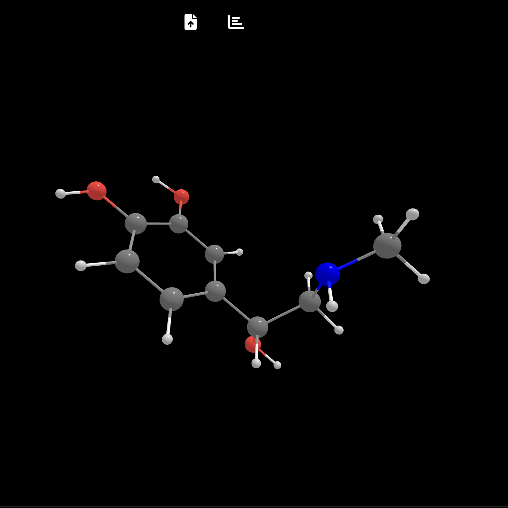
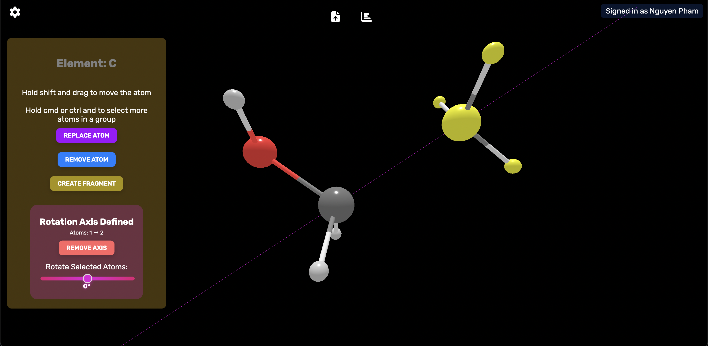
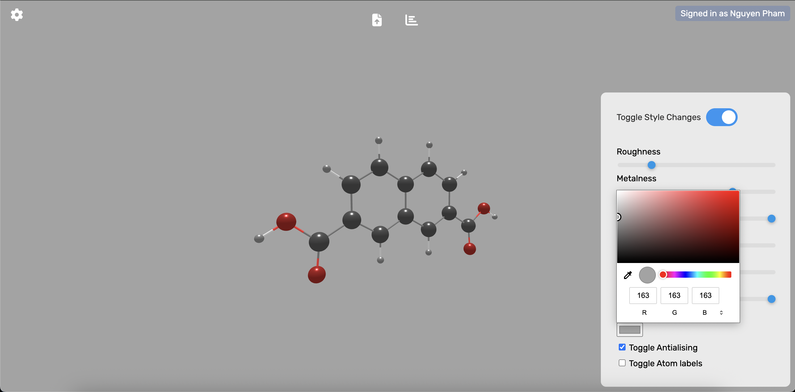

<h1><b>ChopChopMol 2.0 ⚛️ - Molecular Visualiztion GUI</b></h1>

ChopChopMol 2.0 is a huge improvement over version 1.0. The new version is estimated to be about 17 times faster than the first version. We have implemented A.I. capabilities into 2.0. This gives you the ability to generate molecules with the A.I. You can effortlessly edit and modify molecules as well. This is ChopChopMol version 2.0. 

Website:
https://chop-choptech.github.io/ChopChopMol-2.0/

Download Here:
- Mac Download: https://drive.google.com/file/d/18PmPOiFpma-Lor85TI4T-VXY3yI-4D1q/view?usp=sharing

- Windows Download: https://drive.google.com/file/d/1GKVwO9iTfI92neuybPPHa-imM6Kbi_WZ/view?usp=sharing

Note: For a Mac, you may have to go to settings to confirm the download.

</img>

Here are some different features showcased:

- Editing:
</img>

- Customize atom looks
</img>

